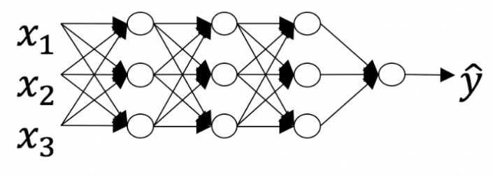
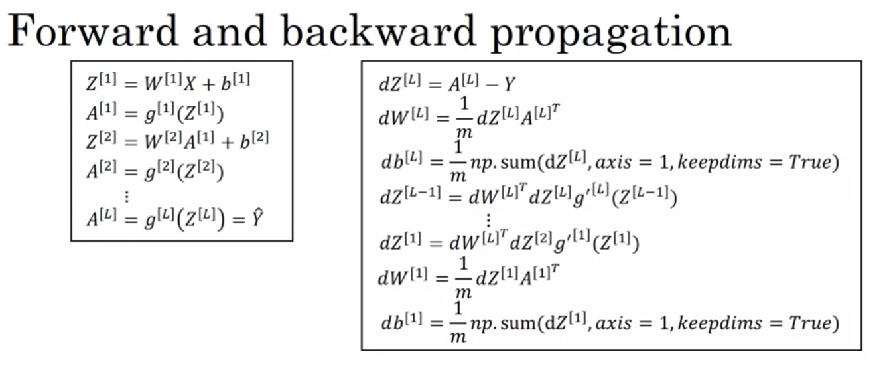
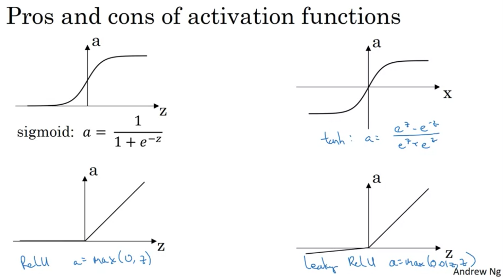
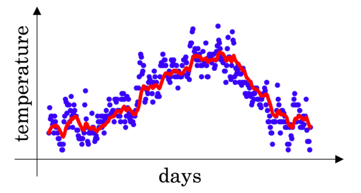
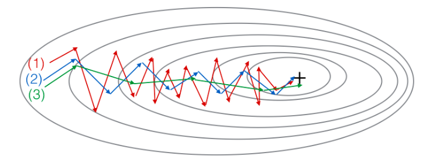
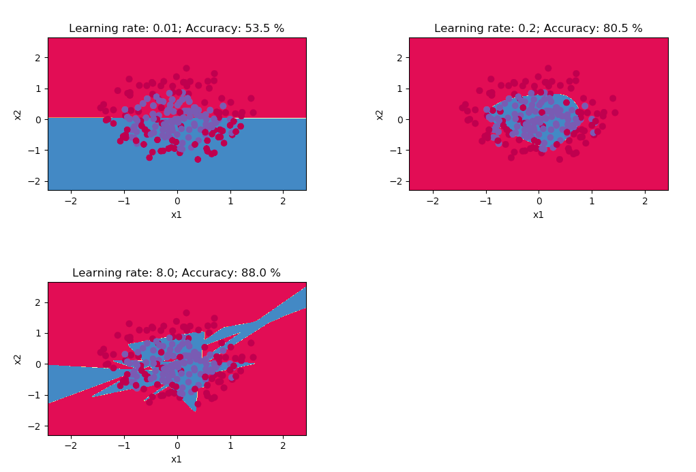
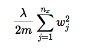
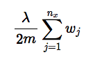

Neural Networks and Deep Learning - Methodology Notes
================
By Tran Nguyen - Materials from the Deep Learning Specialization by deeplearning.ai on Coursera

-   [1. GENERAL ABOUT NEURAL NETWORKS](#general-about-neural-networks)
-   [2. DATA: TRAIN/DEV/TEST SETS](#data-traindevtest-sets)
-   [3. THE BASIC OF NEURAL NETWORKS](#the-basic-of-neural-networks)
-   [4. BIAS AND VARIANCE](#bias-and-variance)
-   [5. BASIC RECIPE FOR MACHINE LEARNING](#basic-recipe-for-machine-learning)
-   [6. REGULARIZATION](#regularization)
-   [7. TUNING PROCESS](#tuning-process)
-   [8. MULTI-CLASS CLASSIFICATION WITH SOFTMAX CLASSIFIER](#multi-class-classification-with-softmax-classifier)
-   [9. COMMON PACKAGES USED IN NEURAL NETWORKS](#common-packages-used-in-neural-networks)
-   [10. DEEP LEARNING FRAMEWORKS](#deep-learning-frameworks)
-   [REFERENCES](#references)

### 1. GENERAL ABOUT NEURAL NETWORKS

#### 1.1. Neural network layer

-   The number of layers is counted as the number of hidden layers + 1. The input and output layers are not counted as hidden layers.
-   The neural network below has: The number of layers L is 4; the number of hidden layers is 3. 
-   The deeper layers of a neural network are typically computing more complex features of the input than the earlier layers.
-   Some modern net has L (the number of layer) as big as 150.

#### 1.2. Hyperparameters of Neural Network

-   Including learning rate, number of iterations, number of hidden layers, hidden layer size (number of hidden units), choice of activation function, momentum, mini-batch size, regulation, learning\_decay\_rate, ...
-   1 epoch: 1 pass/iteration through the data.
-   Applied ML is a highly iterative process, and all the hyperparameters are different and need to be iteratively optimized for each specific problem and dataset.

### 2. DATA: TRAIN/DEV/TEST SETS

-   The data is normally divided into: Training set + Hold-out cross validation set/ Development set/ "Dev" set + Test set.
-   Goal of test set: Provide the unbiased estimate of the performance of the net. If the dataset does not have the test set: cannot have the unbiased estimate. People sometimes use only Train/Dev sets and call Dev set as "test" set. It may be okay if don't need the unbiased estimate; otherwise, it leads to overfitting to the "test" set.

#### 2.1. Size of the sets

-   Ratio of Train/Dev/Test sets for data: 60/20/20 (Best practice for small dataset)
-   In big data era: Ratio of Train/Dev/Test sets: 98/1/1. Example: Data size: 1,000,000 only need: 10,000 examples for "Dev" set and 10,000 examples Test set.
-   Bigger dataset (&gt;1 million examples): 99.5/0.25/0.25 or 99.5/0.4/0.1.

#### 2.2. Important note about the sets

-   Train/Dev/Test sets should have the same distribution.
-   Example of the mismatched distribution: train set: images from webpage; dev/test sets: images from phone app

#### 2.3. Normalizing the inputs

-  Normalizing makes the cost function faster to optimize =&gt; faster learning.
-  Common normalization techniques: 
     + Min-max normalization (x - min)/(max - min): doesnot handle outliers
     + Z-score normalization (x - mean_x)/variance: handle outliers.
-  

#### 2.4. Mini-batch approach

-   The training data can be divide into mini-batch via 2 steps: (1) Shuffling: the random shuffling is done synchronously between X and Y =&gt; examples will be split randomly into different mini-batches. (2) Partitioning the shuffled (X, Y) into mini-batches of size mini\_batch\_size. The last mini batch might be smaller than the full mini\_batch\_size.
-   Notation for the mini-batch: a\[3\]{8}(7): the 3rd layer activations when the input is the 7th example from the 8th mini-batch.
-   Powers of two are often chosen to be the mini-batch size, e.g., 16, 32, 64, 128.
-   Optimized size of the mini-batch: for CNN:

### 3. THE BASIC OF NEURAL NETWORKS

-   A neuron computes a linear function (z=Wx+b) followed by an activation function g. =&gt; The output of a neuron is a=g(Wx+b) where g is the activation function (sigmoid, tanh, ReLU, etc.).

#### 3.1. Parameters of the neural network

-   Including W\[1\], b\[1\], W\[2\], b\[2\], ..., W\[l\], b\[l\]
-   Dim of the first W vector: number of features of X.
-   Matrix dimension of the parameters
    -   W\[l\] and dw\[l\]: (n\[l\],n\[l-1\])
    -   b\[l\] and db\[l\]: (n\[l\],1)
    -   Z\[l\], A\[l\], dZ\[l\], and dA\[l\]: (n\[l\],m), if l=0: A\[0\]=X=(n\[0\],m)

##### 3.1.1. Initialize the parameters

-   Carefully initialize the weight W can partially help the vanishing/exploding gradient problem in very deep neural network.
-   Initialization can get even better training performance on the model (improve accuracy on train and test set)
-   In general, initializing all the weights to zero results in the network failing to break symmetry. This means that every neuron in each layer will learn the same thing, and you might as well be training a neural network with n\[l\]=1 for every layer, and the network is no more powerful than a linear classifier such as logistic regression. =&gt; The weights W\[l\] should be initialized randomly to break symmetry.
-   Initializing with overly large random numbers slows down the optimization.
-   Note: It is however okay to initialize the biases b\[l\] to zeros. Symmetry is still broken so long as W\[l\] is initialized randomly.
-   Implementation of parameter initialization:

``` r
### For W:
parameters['W'+str(l)] = np.random.randn(layer_dims[l],layer_dims[l-1])*init_const

# Using diffent init_const can slow down or faster gradient descent
# Method 1: init_const = 0.01 
# Method 2 ("He Initialization"): for relu activation function: init_const = np.sqrt(2/layer_dims[l-1]) => the most common method.
# Method 3 (Xavier initialization): for tanh activation function: init_const = np.sqrt(1/layer_dims[l-1])
# Method 4: init_const = np.sqrt(2/(layer_dims[l-1] + layer_dims[l]))

### For b:
parameters['b'+str(l)] = np.zeros((layer_dims[l],1))
```

#### 3.2. The basic steps in the neural network

-   The basic steps in the neural network include (i) Forward propagation, (ii) Backward propagation, (iii) Optimization



#### 3.3. Forward propagation

-   Purpose: Calculate the cost function
-   Each neural network layer includes a linear function followed by an activation function.
-   The cost function will be calculated at the final layer (output)

##### 3.3.1. Linear function

Z = np.dot(W.T,X) + b

##### 3.3.2. Activation function

-   Non-linear activation function is a critical part of neural networks =&gt; compute "interesting" function.
-   A = g(Z) in which g(Z) could be sigmoid function, tanh or relu function, etc.
-   Choice of activation? Try them all and choose the best.
-   Some common activation function. Note: each will have different formula for calculate the derivatives. 

###### Sigmoid function

-   s = sigmoid(z) = 1/(1+np.exp(-z))
-   Sigmoid outputs a value between 0 and 1 which makes it a very good choice for binary classification.

###### tanh function

-   The tanh activation usually works better than sigmoid activation function for hidden units because: the output of the tanh is between -1 and 1 =&gt; the mean of its output is closer to zero, and so it centers the data better =&gt; makes the learning simpler for the next layer.
-   Example about tanh function: You have built a network using the tanh activation for all the hidden units. You initialize the weights to relative large values, using np.random.randn(..,..)\*1000 =&gt; tanh becomes flat for large values, this leads its gradient to be close to zero =&gt; This slows down the optimization algorithm.

###### ReLU function

-   The ReLU activation function is the most used in neural networks, helps to decrease training time significantly.

##### 3.3.3. Loss and cost function

###### Loss function

-   The loss for each example in the training set
-   For continuous value output: Common loss function: square error Loss = (y-yhat)^2
-   In logistic regression/categorical classification: common loss function is cross-enrropy. Loss function = -(ylog(yhat) + (1-y)log(1-yhat)), \#\#\#\#\#\# Cost function
-   The cost for all the example in the training set/batch Cost function = -1/m \* sum of the loss function in all training examples m.

Implementation for the cost function for logistic regression/categorical classification:

``` r
# import numpy as np
# Y: true "label" vector
# AL: probability vector corresponding to your label predictions
cost = -(1/m) * np.sum(np.multiply(Y,np.log(AL)) + np.multiply((1 - Y),np.log(1 - AL)))
```

#### 3.4. Backward propagation

-   Purpose: Calculate the gradients.
-   During forward propagation, in the forward function for a layer l you need to know what is the activation function in a layer (Sigmoid, tanh, ReLU, etc.). During backpropagation, the corresponding backward function also needs to know what is the activation function for layer l, since the gradient depends on it.
-   Initializing the backpropagation with dAL: dAL = - (np.divide(Y, AL) - np.divide(1 - Y, 1 - AL))

#### 3.5. Optimization

-   Purpose: Update the parameters using gradient descent.
-   Basic gradient descent: W\[l\] = W\[l\] - learning\_rate \* dW\[l\] b\[l\] = b\[l\] - learning\_rate \* db\[l\]
-   Disadvantage: (i) It may take a long time to optimize the cost function (ii) In very high-dimensional spaces, the gradient descent is more likely to run into the saddle point rather than local optima. =&gt; Plateaus on saddle point (the region where the derivative is close to zero for a long time) can really slow down learning
    =&gt; Other optimization algorithms (momentum, RMSprop, Adam, etc.) help to speed up the training time.

##### 3.5.1. Gradient descent approaches on train data

-   Batch, mini-batch or stochastic gradient descent
-   With mini-batch gradient descent, you loop over the mini-batches instead of looping over individual training examples.
-   In Stochastic Gradient Descent, you use only 1 training example before updating the gradients. When the training set is large, SGD can be faster. But the parameters will "oscillate" toward the minimum rather than converge smoothly.

``` r
# Batch gradient descent:
for i in range(0, num_iterations):
  forward_prop, backward_prop, update_parameters

# Stochastic gradient descent:
for i in range(0, num_iterations):
  for j in range(0, m):
    forward_prop, backward_prop, update_parameters

# Mini-batch gradient descent:
for i in range(0, num_iterations):
  for j in range(0, num_mini_batches):
    forward_prop, backward_prop, update_parameters
```

-   With a well-turned mini-batch size, usually it outperforms either gradient descent or stochastic gradient descent (particularly when the training set is large).
-   You have to tune a learning rate hyperparameter α when using mini-batch(?)
-   Because mini-batch gradient descent makes a parameter update after seeing just a subset of examples, the direction of the update has some variance, and so the path taken by mini-batch gradient descent will "oscillate" toward convergence.
-   With very deep net, the vanishing/exploding gradients problem can happen =&gt; Carefully initialize the weight W can partially help.
-   One iteration of mini-batch gradient descent (computing on a single mini-batch) is faster than one iteration of batch gradient descent.

##### 3.5.2. Gradient descent approaches

-   These algorithms are designed to reduce the oscillations (caused by mini-batch or stochastic gradient descent).
-   RMSprop and Adam are the two rare optimization algorithms that have been shown to work well across a wide range of deep learning architectures.

###### Gradient descent with Momentum

-   This will almost always work better than the straightforward gradient descent algorithm without momentum.
-   It can be applied with batch gradient descent, mini-batch gradient descent or stochastic gradient descent.
-   Momentum using the momentum β parameter in updating W and b.
-   Momentum implementation

``` r
# Matrix dimension of velocity_dW and velocity_db is similar to dW, db
# for weight W
velocity_dW = β + (1-β)dW
W = W - α*velocity_dW
# for b
velocity_db = β + (1-β)db
b = b - α*velocity_db
# α: learning rate, β: momentum
```

-   The velocity is initialized with zeros. So the algorithm will take a few iterations to "build up" velocity and start to take bigger steps.
-   If β=0, then this just becomes standard gradient descent without momentum.
-   The larger the momentum β is, the smoother the update because the more we take the past gradients into account. But if β is too big, it could also smooth out the updates too much.
-   Common values for β range from 0.8 to 0.999. If you don't feel inclined to tune this, β=0.9 is often a reasonable default.
-   Tuning the optimal β for your model might need trying several values to see what works best in term of reducing the value of the cost function J.
-   More instuition about momentum: Example: You use an exponentially weighted average on the London temperature dataset. You use the following to track the temperature: v{t} = βv{t-1}+(1−β)θ{t} The red line below was computed using β=0.9. What would happen to your red curve as you vary β?  =&gt; Increasing β will shift the red line slightly to the right. Decreasing β will create more oscillation within the red line.

-   Momentum effect: The plots in the image below were generated with gradient descent; with gradient descent with momentum (β = 0.5) and gradient descent with momentum (β = 0.9). (1) is gradient descent. (2) is gradient descent with momentum (small β). (3) is gradient descent with momentum (large β)



###### Gradient descent with RMSprop (Root Mean Square prop)

-   RMSprop implementation
-   Similar to Momentum, but using square root of s\_dW.

``` r
# Matrix dimension of s_dW and s_db is similar to dW, db
s_dW = β*s_dW + (1-β)*((dW)**2) #(element-wise)
s_db = β*s_db + (1-β)*((db)**2) #(element-wise)
W = W - α*(dW/(sqrt(s_dW))
b = b - α*(db/(sqrt(s_db))
```

###### Gradient descent with Adam (Adaptive Moment Estimation)

-   A combination of Momentum and RMSprop, combines the advantages of these 2 algorithms.
-   Has bias correction
-   Hyperparameters choice: Default: beta1 = 0.9, beta2=0.999, epsilon = 10^-8 (preventing division by zero in Adam updates).
-   Need to tune the learning rate for better result.
-   Adam implementation:

``` r
# for weight W
velocityW = β1 * velocityW + (1-β1)dW # momentum β1
sW = β2 * sW + (1-β2)(dW)**2 # RMSprop β2
velocityW_corrected = velocityW/(1-(β1**t))
sW_corrected = sW/(1-(β2**t))
W = W - α*(velocityW_corrected/(sqrt(sW_corrected) + ε))

# the same for b
# α: learning rate, β1: first momentum estimates, β2: second momentum estimates, ε: hyperparameter preventing division by zero in Adam updates
# Matrix dimension of velocityW, sW, velocityb and sb is similar to dW, db
```

-   Some advantages of Adam include: - Relatively low memory requirements (though higher than gradient descent and gradient descent with momentum) - Usually works well even with little tuning of hyperparameters (except α).

##### 3.5.3. Gradient checking:

-   Use to debug (don't use in training)

##### 3.6. Batch Norm (batch normalization)

-   Advantage: (i) take on a similar range of values that can speed up learning (ii) allows each layer of the network to learn by itself, a little bit more independently of other layers, and this has the effect of speeding up of learning in the whole network. (iii) Batch Norm in each mini-batch add some noise to the activation value =&gt; has a slight regularization effect (by adding some noise to each hidden layer's activation) =&gt; using a bigger mini-batch size (example: 512 instead of 64) can reduce the regularization effect.
-   Normalizing z before calculating the activation function a.
-   With Batch Norm, b is removed.
-   Work with many optimization algorithms (momentum, RMSprop, Adam)
-   Performing Batch Norm:

``` r
### In training
Znorm = (Zi - μ)/sqrt(δ^2 + ε)
# ε is used to prevent dividing by 0 case 
Ztilde = γ *  Znorm + β
#γ and β: learning rate
# If γ = sqrt(δ^2 + ε) and β = μ: Ztilde == Zi

### In testing
#Using μ and δ which are estimated using exponentially weighted average (across mini-batches)
```

-   Implementing Batch Norm in gradient descent:

``` r
for t in range (1, num_MiniBatches+1):
  Forward propagation on X{t}. Use BN in each hidden layer.
  Backward propagation: compute dW, dγ, dβ for each hidden layer.
  Update parameters Wl = Wl - α*dWl , γl = γl - α*dγl, and βl = βl - α*dβl
```

### 4. BIAS AND VARIANCE

-   High bias/"underfitting", "just right" and high variance/"overfitting"
-   Example of likely "underfitting", "just right" and "overfitting" cases when tweaking the learning rate hyperparameter - visuallization with the training data on the planar dataset:

 \#\#\#\# Using train set/dev set error to evaluate bias and variance:

``` r
*** The estimation depends on the comparison with the optimal error:
- Supposed the human level performance (Optimal error or Bayes error) ~ 0% error: 
+ Train set error: Dev set error: 15%:16% => high bias (underfitting)
+ Train set error: Dev set error: 1%:11% => high variance (overfitting)
+ Train set error: Dev set error: 15%:30% => high bias and high variance
+ Train set error: Dev set error: 0.5%:1% => low bias and low variance

- If, for example, the human level performance (Optimal error or Bayes error) ~ 15% error:
 Train set error: Dev set error: 15%:16% could be the case of low bias and low variance
```

### 5. BASIC RECIPE FOR MACHINE LEARNING

-   Steps for evaluating the network after building the model:

``` r
- Step 1:  Does the net suffer high bias? (Checking training data performance)
         => Yes: + Try bigger network (more hidden units/more hidden layers)
                 + Try training longer
                 + Try different NN architecture (not so popular)
- Step 2: Does the net suffer high variance? (Checking dev set performance)
        => Yes:  + Try more data
                 + Try regulization
                 + Try different NN architecture 
- Weight Initialization methods can get even better training performance on the model.
```

-   "Bias variance tradeoff": In the era of big data, bigger network and more data help to escape the tradeoff. (Trying bigger network will not hurt the variance, and trying more data will not hurt the bias)
-   "Orthoganization": doing 1 task at a time for (1) Optimize the cost function but (2) Avoid "overfitting"
-   If batch gradient descent in a deep network is taking excessively long to find a value of the parameters that achieves a small value for the cost function J. =&gt; Try tuning the learning rate α, try better random initialization for the weights; try using Adam, try mini-batch gradient descent.

### 6. REGULARIZATION

-   Including L regularization, Dropout regularization, Data augmentation

#### 6.1. L regularization

-   Loss function = loss + regularization
-   L regularization makes your decision boundary smoother: A model with small weights is simpler than a model with large weights. Thus, by penalizing the square values of the weights in the cost function you drive all the weights to smaller values. It becomes too costly for the cost to have large weights! This leads to a smoother model in which the output changes more slowly as the input changes. =&gt; Weights end up smaller ("weight decay").
-   Weight decay: A regularization technique (such as L2 regularization) that results in gradient descent shrinking the weights on every iteration.
-   The λ hyperparameter: "lambda" is a reserved keyword in Python =&gt; use lambd instead.
-   λ can be used for tuning using a dev set: If λ is too large =&gt; possible to "oversmooth", resulting in a model with high bias.

##### 6.1.1. L2 regularization (commonly used)



-   L2 regularization implementation:

``` r
### Forward propagation with L regularization
# Cost without regularization
cross_entropy_cost = compute_cost(A3, Y) # This gives you the cross-entropy part of the cost
# Calculate regularization term 
L2_regularization_cost = 1/m*lambd/2* (np.sum(np.square(W1)) + np.sum(np.square(W2)) + np.sum(np.square(W3)))
# Add regularization term to the cost
cost = cross_entropy_cost + L2_regularization_cost

### Backward propagation with L regularization
# Add the regularization term's gradient λ/m*W to the gradient with respect to W
dW[l] = 1./m * (np.dot(dZ[l], A[l-1].T) + lambd * W[l]) 
```

##### 6.1.2. L1 regularization (not used much)



#### 6.2. Dropout regularization

-   Randomly eliminate/drop out/shut down some neurons in each iteration. The idea behind drop-out is that at each iteration, you train a different model that uses only a subset of your neurons. With dropout, your neurons thus become less sensitive to the activation of one other specific neuron, because that other neuron might be shut down at any time.
-   There are many implementation techniques, the most common is "Inverted dropout"
-   keep\_prob = 0.8: possibility to keep a node (20% chance the node is eliminated)
-   Different values of keep\_prob for different layer. Input and output layer, keep\_prob = 1.0. The "complicated" hidden layer can have a lower keep\_prob value.
-   Inverted: a3/=keep\_prob: ensures the expected value of a3 remains the same.
-   Note: Only use dropout in training. No dropout in testing.
-   With the inverted dropout technique, at test time, you do not apply dropout (do not randomly eliminate units) and do not keep the 1/keep\_prob factor in the calculations used in training
-   Example: Increasing the parameter keep\_prob from 0.5 to 0.6 will likely cause reducing the regularization effect. \#\#\#\#\# Usage:
-   Commonly used in Computer vision
-   Only used in overfitting problem.
-   Downside: Cost function J is not well defined =&gt; turn off dropout in debugging the cost function.

##### Dropout regularization implementation

-   keep\_prob - probability of keeping a neuron active during drop-out (scalar type)

``` r
### Forward propagation with dropout
# Initialize matrix D
D = np.random.rand(A.shape[0], A.shape[1])
# Convert entries of D to 0 or 1 (using keep_prob as the threshold)
D = D < keep_prob # => True => 1 => Keep
# Example: keep_prob = 0.8: All between 0 and 0.8 will be keep (value 1) 
# Shut down some neurons of A
A = np.multiply(A, D) #element-wise
# Scale the value of neurons that haven't been shut down
A = A/keep_prob
# By doing this you are assuring that the result of the cost will still have the same expected value as without drop-out. (This technique is also called inverted dropout) (In other words, it ensures that the value of A does not reduce due to the zeroing out of random nodes)
# for example: The values of np.sum(A1) before, during dropout and after inverted dropout are: 14.487743021, 11.1624966752, and 15.9464238217, respectively.

### Backward propagation with dropout
dA = np.multiply(dA, D)              # Step 1: Apply mask D to shut down the same neurons as during the forward propagation
dA = dA/keep_prob              # Step 2: Scale the value of neurons that haven't been shut down. (The calculus interpretation is that if  Ais scaled by keep_prob, then its derivative  dA is also scaled by the same keep_prob.)
```

#### 6.3. Other regularization methods

-   Data augmentation
-   Early stopping (plotting training set error and dev set error versus number of iterations, then check when to stop the training). Downside: violate the ""Orthoganization" concept.

### 7. TUNING PROCESS

#### 7.1. Priority of hyperparameters in the tuning process

-   1st priority: learning rate alpha.
-   2nd priority: beta momentum, mini-batch size, number of hidden units.
-   3rd priority: number of hidden layers, learning\_decay\_rate
-   Adam parameters are usually used as default: beta1 = 0.9, beta2=0.999, epsilon = 10^-8

#### 7.2. Tuning approach

-   Try random values, don't use a grid. Go from coarse to fine.
-   Try babysitting one model ("Pandas" approach) or training many models in parallel ("Caviar" approach). Which approach could be used depends on the amount of computational power you can access.
-   How to pick the hyperparameters at random:
-   For learning rate α:

``` r
r = -4 * np.random.rand()
# => r is in range [-4,0]
α = 10^r
# => α is in range(0.0001,1)
```

-   For β (momentum)

``` r
r in range [-3,-1]
1-β = 10^r
β = 1 - 10^r
# => β in range 0.9 ... 0.999

#β in range 0.9 ... 0.99:
r =np.random.rand()
β = 1-10**(-r-1)
```

#### 7.3. Learning rate decay

-   Tuning learning rate α is one of the most important tuning hyperparameters. Changing α is one of the most common operation in tuning.
-   Learning rate decay: changing the learning rate through different epoches. This is not commonly used in tuning.
-   Learning rate decay implementation

``` r
#Method 1:
α = 1/(1 + decay_rate * epoch_num)*α0
# For example:α0 = 0.2, decay_rate = 1
# => epoch 1: α = 0.1, epoch 2: α = 0.067,  epoch : α = 0.05, epoch : α = 0.04, etc.

#Method 2: Exponential decay
α = (0.95^epoch_num)*α0
#Method 3: 
α = (k/sqrt(epoch_num))*α0 or (k/sqrt(t))*α0 (t: epoch number)
#Method 4: Discrete staircase 
α = α/2 after some epoches.
#Method 5: Manual decay for learning rate
Tuning α by hand, days by days
```

### 8. MULTI-CLASS CLASSIFICATION WITH SOFTMAX CLASSIFIER

-   Implementation:

``` r
#For the final hidden layer L:
Z_l = W_l * a_(l-1) + b_l
t = e^Z_l
a_L = t / sum(t)
```

### 9. COMMON PACKAGES USED IN NEURAL NETWORKS

-   numpy: scientific computing with Python.
-   h5py: to interact with a dataset that is stored on an H5 file.
-   matplotlib: plot graphs in Python.
-   PIL and scipy: picture manipulation.

### 10. DEEP LEARNING FRAMEWORKS

-   Common frameworks: Caffe/Caffe2, CNTK, DL4J, Keras, Lasagne, mxnet, PaddlePaddle, TensorFlow, Theano, Torch.
-   These frameworks have evolved rapidly =&gt; Need to choose one that ease of programming (development and deployment), running speed, truly open (open source with good governance).

### REFERENCES

1.  DL history and some technical aspects: <https://www.cse.iitb.ac.in/~pjyothi/cs753_spr16/cnn.pdf>
2.  Using math in R markdown: <https://www.calvin.edu/~rpruim/courses/s341/S17/from-class/MathinRmd.html>
